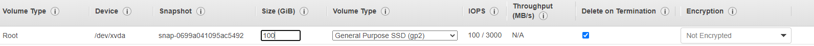
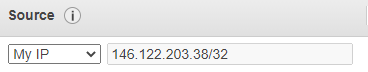

# Using AWS EC2 to speed up training 
Refer to https://aws.amazon.com/ec2/getting-started/ 
## 1. Get yourself an AWS account by registering one or contacting your manager 

## 2. Launch your instance 

Open https://console.aws.amazon.com/ec2/v2/home?region=us-east-1

<p align="center"></p>

### 2.1. Choose AMI

Select the Amazon Linux 2 AMI. 

<p align="center"></p>

### 2.2. Choose instance type

The EC2 instance types are listed in https://aws.amazon.com/ec2/instance-types/. Fot machine learning I chose the p3.2xlarge in Accelerated Computing. 

<p align="center"></p>

### 2.3. Configure Instance Details 

Create a new VPC and add a new subnet. Leave the IAM role blank and all other settings default. 

<p align="center"></p>

<p align="center"></p>

### 2.4. Add storage 

Attach storage to your instance. I made the root 100GB to store the data file and the cuda setting files. 

<p align="center"></p>

### 2.5. Configure security group

Create a new security group. Select the sourse to be My IP and keep other settings default. 

<p align="center"></p>

### 2.6. Review and launch the instance

## 3. Start the instance and connect 

Open the EC2 console to start the instance and connect. Download the .pem file for connection. Navigate to the folder where .pem is and type in console:

```bash
ssh -i /path/my-key-pair.pem my-instance-user-name@my-instance-public-dns-name
```

For other ways to connect see https://docs.aws.amazon.com/AWSEC2/latest/UserGuide/AccessingInstances.html

## 4. Upload data files to your instance 

Download FileZilla to transfer data referring to https://angus.readthedocs.io/en/2014/amazon/transfer-files-between-instance.html

## 5. Install Docker on your instance 

Refer to [Docker basics for Amazon ECS](https://docs.aws.amazon.com/AmazonECS/latest/developerguide/docker-basics.html).

## IMPORTANT: SHUT DOWN THE INSTANCE AFTER USING!

...don't be bothered if you are super rich though :)

You might find the [AWS Instance Scheduler](https://aws.amazon.com/solutions/implementations/instance-scheduler/) useful. 


Now you are good to go [setting tf3d](https://github.com/zhangyuyi99/google-research/blob/8960137f970ba8676062ec30bc32b38126d3df85/tf3d/docs_new/installation.md) and start your first experiment! 


